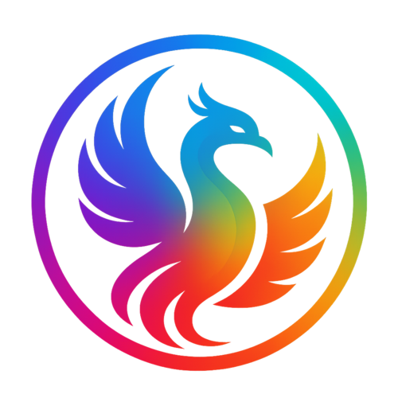

# Obsidian Theme Engine

[](https://opensource.org/licenses/MIT)
[](https://github.com/YazanAmmar/obsidian-theme-engine/releases)
[](https://github.com/YazanAmmar/obsidian-theme-engine/releases)
[](https://github.com/YazanAmmar/obsidian-theme-engine/blob/main/src/i18n/strings.ts)
[](https://github.com/YazanAmmar/obsidian-theme-engine/stargazers)
[](https://github.com/YazanAmmar/obsidian-theme-engine/issues)

**A full theme-engine for Obsidian. Colors, backgrounds, snippets, profiles — all in one place.**

  Theme Engine exposes a broad set of core Obsidian CSS color variables (plus your own custom ones) through a polished UI. Manage profiles, snippets, and even video backgrounds—no CSS knowledge required, but perfect for power users.

<p align="center">
  
</p>

## Table of Contents

- [Overview](#overview)
- [Why Theme Engine?](#why-theme-engine)
- [Features](#features)
- [Project Structure](#project-structure)
- [Supported Languages](#supported-languages)
- [Included Profiles](#included-profiles)
- [Screenshots / Demos](#screenshots--demos)
- [Color Variable Reference](#color-variable-reference)
- [Installation (End User)](#installation-end-user)
- [Building from Source (Developer)](#building-from-source-developer)
- [Usage Guide & Examples](#usage-guide--examples)
  - [1. Profiles: Create, Import, Export](#1-profiles-create-import-export)
  - [2. Setting a Custom Background (Image/Video)](#2-setting-a-custom-background-imagevideo)
  - [3. Using CSS Snippets (Profile & Global)](#3-using-css-snippets-profile--global)
  - [4. Advanced Notice Coloring](#4-advanced-notice-coloring-keywords--regex)
- [Hotkeys (Commands)](#hotkeys-commands)
- [Performance & Tips](#performance--tips)
- [Changelog (Summary)](#changelog-summary)
- [Roadmap](#roadmap)
- [Contributing](#contributing)
- [Troubleshooting / FAQ](#troubleshooting--faq)
- [License](#license)
- [Contact / Links](#contact--links)

---

## Overview

Theme Engine is an Obsidian plugin that allows you to edit and manage a large set of Obsidian’s core CSS color variables using an interactive UI. Create theme **profiles** (bundles of colors, snippets, notice rules, and settings), switch between them instantly, export/share them as JSON, or even import CSS from your installed themes to create new, editable profiles.

Designed for both:

- **Beginners** — Simple color pickers, preset profiles, and a "Set Background" feature to get a polished look fast.
- **Power users / Developers** — Full variable list, per-profile & global snippets, drag-and-drop reordering, regex notice rules, and exportable JSON.

---

## Why Theme Engine?

- **Dynamic Theme Engine**: Theme Engine acts as a **smart layer** on top of your existing theme. It dynamically captures your active theme's colors, allowing you to override only what you need.
- **Centralize Control:** Unify theme tweaks into **Profiles** (collections of variables + snippets + backgrounds).
- **No More CSS Sprawl:** Keep small CSS hacks tied to specific profiles instead of managing dozens of separate `.css` files.
- **Shareable Themes:** Create shareable theme packages (profiles export to a single `.json` file).
- **Automate Your Workspace:**
  - Force Dark/Light mode automatically per profile.
  - Apply custom video or image backgrounds per profile.
- **Intelligent & Dynamic:**
  - Style notice boxes by content (keyword / regex / keyword highlighting).
  - Get warned if an external theme might be interfering with your profile.
- **Performance Tuned:** Use the Live Preview FPS slider to balance visual feedback with CPU usage on your machine.

---

## Features

### 1. Core Profile Management

- **Live Color Editor**: An intuitive UI with color pickers and text inputs for over 100 core Obsidian color variables. It now provides instant visual feedback: variables matching your theme's default are **dimmed** (`Pristine`), while your customizations **light up** (`Modified`).
- **Full Profile Management**: Create, delete, rename, and switch between multiple color profiles.
- **Import / Export**:
  - **Export to JSON**: Save your complete profile (colors, snippets, rules, background path) to a single `.json` file.
  - **Import from JSON**: Import a profile JSON. The UI lets you choose a new name, preventing accidental overwrites.
- **Beautiful Default Themes**: Comes with 3 stunning, ready-to-use profiles to get you started.

### 2. Advanced Customization

- **Per-Profile Backgrounds (Image & Video!)**:
  - Set a custom **image or video** background for each profile.
  - Built-in **Background Browser** to manage all your media: select, rename, and safely delete.
  - Easily add new media via file upload, drag & drop, or pasting a URL.
  - Automatically applies necessary transparency to UI elements for you.
  - Dedicated settings for **video (opacity, mute)** and **images (JPG conversion/quality)**.
- **Import from Installed Themes**:
  - Instantly create a new, editable CSS-based profile by importing the code from your already-installed community themes or snippets.
- **Advanced Notice Coloring**:
  - Control the background and text color of pop-up notices based on their content (keywords or Regex).
  - **New**: "Highlight Only" mode to apply color _only_ to specific keywords within a notice.
  - Rules are saved **per-profile** and are included in exports.
- **CSS Snippets (Profile & Global)**:
  - **Per-Profile Snippets**: Attach CSS snippets that are _only_ active when their profile is active. Included in exports.
  - **Global Snippets**: Create snippets that stay active across _all_ of your profiles, perfect for a custom font or a small, universal UI tweak.
  - **Drag & Drop**: Easily reorder your snippets with drag & drop to manage CSS priority (cascade).
  - **Lock Reordering**: A lock button to prevent accidental reordering of snippets.

### 3. Workflow & UI

- **Complete i18n Overhaul (Translation System)**:
  - **Custom Languages Support:** No longer limited to the 4 built-in languages. Add **any language** (e.g., Chinese, Spanish) directly from the settings.
  - **Tree-View Translation Editor:** A powerful modal to edit translations in a nested tree, with deep search and highlighting.
  - **Management Tools:** Import, Export, Copy, and Paste translations as JSON.
  - **Smart Fallback Engine:** Gracefully falls back to English for any missing keys.
- **Quick Theme Toggle**: Instantly cycle the active profile's theme setting between "Force Light," "Force Dark," and "Auto" with a new icon in the profile manager.
- **Ribbon Icon**: Access the Theme Engine settings with a single click from the Obsidian ribbon.
- **Selective Data Reset**: The "Reset Plugin" feature is now granular. You can choose to delete only specific categories of data (Profiles, Snippets, Backgrounds, Settings, or Languages).
- **Theme Interference Warning**: A small icon appears if you have a community theme enabled, warning you that it might override your Theme Engine settings.
- **Add Custom CSS Variables**:
  - Add any CSS variable (e.g., from another plugin) to the UI.
  - Define its type (color, size, text, number) for the correct UI controls.
  - Custom variables are saved and exported with your profile.
- **Reliable Profile Snapshots**: Use the **Pin** button to save a complete snapshot of your profile (colors, CSS, snippets, rules). Experiment freely and restore with one click.
- **Multi-Step Color Undo**: The "Undo" icon (`reset`) remembers the last 5 changes you made to each specific color.
- **Plugin Integrations**: Full color control for the **Iconize** plugin, with an automated cleanup system.

---

## Project Structure

The codebase is organized by concern: plugin core, UI, modal system, i18n, and SCSS layers.

```text
src/
|- main.ts                  # Plugin entrypoint and lifecycle orchestration
|- constants.ts             # Built-in defaults, maps, and static config
|- types.ts                 # Shared TypeScript domain types
|- utils.ts                 # Cross-cutting utility helpers
|
|- commands/
|  |- index.ts              # Command registration and command handlers
|
|- i18n/
|  |- strings.ts            # Translation engine + fallback behavior
|  |- types.ts              # i18n-specific typings
|  |- locales/              # Built-in locales + custom locale files
|     |- en.ts
|     |- ar.ts
|     |- fr.ts
|     |- fa.ts
|
|- styles/
|  |- main.scss             # Root SCSS entry (compiled to styles.css)
|  |- base/                 # Core tokens, animation, layout direction, editor styles
|  |- components/           # Shared component-level styles
|  |- modals/               # Styles scoped to modal experiences
|  |- settings/             # Settings tab layout, controls, search, accessibility
|
|- ui/
   |- settingsTab.ts        # Main settings screen composition
   |- components/           # Reusable settings UI sections/widgets
   |- modals/               # Modal architecture split by feature domain
      |- index.ts           # Central modal exports
      |- base.ts            # Shared modal base class/infrastructure
      |- info.ts            # Informational modal(s)
      |- common/            # Generic dialogs (confirmation, file conflict)
      |- editors/           # Content editors (CSS, notice rules, custom vars)
      |- profiles/          # Profile creation/import/browser modals
      |- settings/          # Settings-related modals (language, translator, etc.)
```

---

## Supported Languages

Theme Engine has a powerful, extensible translation system. It includes full support for 4 built-in languages and allows you to add your own **Custom Languages** via the settings menu.

**Built-in Languages:**

- **English** (Default)
- **العربية (Arabic)** - Full RTL Support
- **Français (French)**
- **فارسی (Persian)** - Full RTL Support

---

## Included Profiles

The plugin comes with these hand-crafted profiles by default:

1. **Default**: A dynamic profile that acts as a **transparent layer**, automatically capturing and adopting the colors of your currently active Obsidian theme.
2. **OLED Matrix**: A true-black, high-contrast theme with vibrant green accents.
3. **Citrus Zest**: A brilliant light theme with a clean design and stunning orange highlights.

---

## Screenshots / Demos

### Default Themes

| **OLED Matrix (Dark)**                                         | **Citrus Zest (Light)**                                        |
| -------------------------------------------------------------- | -------------------------------------------------------------- |
|  |  |

---

## Color Variable Reference

Theme Engine exposes **105 core CSS variables** from Obsidian’s theme system.  
These variables are grouped internally by category and can be edited visually through the plugin UI.

Each entry below shows:

- **Variable** — the CSS variable name
- **UI Label** — how it appears inside Theme Engine
- **Description** — what the variable controls

> [!TIP]  
> Theme Engine also supports **custom CSS variables**.  
> You can add variables from other plugins or themes directly from the **Custom Variables** section in the settings.

<details> <summary><strong>Click to expand the full list of supported CSS variables</strong></summary>

|Variable|UI Label|Description|
|---|---|---|
|`--iconize-icon-color`|Iconize icon color|Sets the color for all icons added by the Iconize plugin and overrides its internal color settings.|
|`--background-primary`|Background primary|Main background color for the entire app, especially editor and note panes.|
|`--background-primary-alt`|Background primary alt|Alternate background often used for active editor lines.|
|`--background-secondary`|Background secondary|Secondary background used for sidebars and panels.|
|`--background-secondary-alt`|Background secondary alt|Alternate sidebar background used for active files.|
|`--background-modifier-border`|Border|Border color used across UI elements such as buttons and inputs.|
|`--background-modifier-border-hover`|Border (hover)|Border color when hovering UI elements.|
|`--background-modifier-border-focus`|Border (focus)|Border color when an element is focused.|
|`--background-modifier-flair`|Flair background|Background used for special UI states like syncing indicators.|
|`--background-modifier-hover`|Hover background|Background color when hovering list items or controls.|
|`--background-modifier-active`|Active background|Background color when elements are selected or clicked.|
|`--text-normal`|Normal text|Default text color used across notes and most UI elements.|
|`--text-muted`|Muted text|Slightly faded text used for secondary information.|
|`--text-faint`|Faint text|Very subtle text used for disabled or low-priority UI.|
|`--text-on-accent`|Text on accent|Text color displayed on top of accent backgrounds.|
|`--text-accent`|Accent text|Accent color used for links and highlighted UI elements.|
|`--text-accent-hover`|Accent text (hover)|Accent text color when hovering links.|
|`--text-selection`|Text selection|Background color of selected text.|
|`--checklist-done-color`|Checklist done|Color used for completed checklist items.|
|`--tag-color`|Tag text|Text color of tags.|
|`--tag-color-hover`|Tag text (hover)|Tag color when hovering over tags.|
|`--tag-bg`|Tag background|Background color for tags.|
|`--nav-item-color`|Nav item text|Default text color for items in navigation lists.|
|`--nav-item-color-hover`|Nav item text (hover)|Text color when hovering navigation items.|
|`--nav-item-color-active`|Nav item text (active)|Text color of the active navigation item.|
|`--nav-item-background-hover`|Nav item background (hover)|Background color when hovering navigation items.|
|`--nav-item-background-active`|Nav item background (active)|Background color for selected navigation items.|
|`--link-color`|Link color|Default color for internal Markdown links.|
|`--link-color-hover`|Link color (hover)|Color for internal links when hovering.|
|`--link-external-color`|External link color|Default color for external links.|
|`--link-external-color-hover`|External link color (hover)|External link color when hovering.|
|`--link-unresolved-color`|Unresolved link color|Color for links pointing to notes that do not exist yet.|
|`--caret-color`|Caret color|Color of the text cursor in editing mode.|
|`--code-comment`|Code comment|Syntax color used for comments in code blocks.|
|`--code-function`|Code function|Syntax color for function names in code blocks.|
|`--code-keyword`|Code keyword|Syntax color for language keywords.|
|`--code-operator`|Code operator|Syntax color for operators in code blocks.|
|`--code-property`|Code property|Syntax color for object properties in code blocks.|
|`--code-string`|Code string|Syntax color for string values in code blocks.|
|`--h1-color`|H1 color|Color of H1 headings.|
|`--h2-color`|H2 color|Color of H2 headings.|
|`--h3-color`|H3 color|Color of H3 headings.|
|`--h4-color`|H4 color|Color of H4 headings.|
|`--h5-color`|H5 color|Color of H5 headings.|
|`--h6-color`|H6 color|Color of H6 headings.|
|`--hr-color`|Horizontal rule|Color of horizontal rule lines (`---`).|
|`--blockquote-border-color`|Blockquote border|Color of the vertical border in blockquotes.|
|`--blockquote-color`|Blockquote text|Text color inside blockquotes.|
|`--blockquote-bg`|Blockquote background|Background color for blockquotes.|
|`--code-normal`|Inline code text|Text color inside inline code.|
|`--code-background`|Inline code background|Background color for inline code blocks.|
|`--text-highlight-bg`|Highlighted text background|Background color of highlighted text.|
|`--table-background`|Table background|Background color of Markdown tables.|
|`--table-border-color`|Table border|Border color of Markdown tables.|
|`--table-header-background`|Table header background|Background color of table headers.|
|`--table-row-alt-background`|Table alt row background|Alternate row background color in tables.|
|`--callout-default`|Callout default|Base color for note callouts.|
|`--callout-info`|Callout info|Base color for info callouts.|
|`--callout-warning`|Callout warning|Base color for warning callouts.|
|`--callout-error`|Callout error / danger|Base color for error and danger callouts.|
|`--callout-success`|Callout success|Base color for success callouts.|
|`--callout-tip`|Callout tip|Base color for tip and hint callouts.|
|`--callout-question`|Callout question|Base color for question, help, and FAQ callouts.|
|`--callout-important`|Callout important|Base color for important callouts.|
|`--callout-bug`|Callout bug|Base color for bug callouts.|
|`--callout-example`|Callout example|Base color for example callouts.|
|`--callout-quote`|Callout quote|Base color for quote and cite callouts.|
|`--callout-todo`|Callout todo|Base color for todo callouts.|
|`--callout-summary`|Callout summary|Base color for summary callouts.|
|`--callout-fail`|Callout fail / failure|Base color for fail, failure, and missing callouts.|
|`--interactive-normal`|Interactive normal|Background color for buttons and interactive controls.|
|`--interactive-hover`|Interactive hover|Background color when hovering interactive elements.|
|`--interactive-accent`|Interactive accent|Accent color for important actions and buttons.|
|`--interactive-accent-hover`|Interactive accent hover|Accent color when hovering important buttons.|
|`--interactive-success`|Success color|Color indicating successful operations.|
|`--interactive-error`|Error color|Color indicating error states.|
|`--interactive-warning`|Warning color|Color indicating warning states.|
|`--titlebar-background`|Titlebar background|Background color of the window title bar.|
|`--titlebar-background-focused`|Titlebar background (focused)|Title bar color when the window is active.|
|`--titlebar-text-color`|Titlebar text|Text color of the title bar.|
|`--sidebar-background`|Sidebar background|Background color of sidebars.|
|`--sidebar-border-color`|Sidebar border|Border color next to sidebars.|
|`--header-background`|Header background|Background color for pane headers.|
|`--header-border-color`|Header border|Border color below pane headers.|
|`--vault-name-color`|Vault name|Color of the vault name displayed in the sidebar.|
|`--tab-background-active`|Active tab background|Background color of the active tab.|
|`--tab-text-color`|Tab text|Text color of inactive tabs.|
|`--tab-text-color-active`|Active tab text|Text color of the active tab.|
|`--workspace-background-translucent`|Workspace translucent background|Translucent background used behind overlays.|
|`--cm-notice-text-default`|Default notice text|Default text color for notices unless overridden by rules.|
|`--cm-notice-bg-default`|Default notice background|Default background color for notices unless overridden by rules.|
|`--graph-line`|Graph line|Color of connections between notes in graph view.|
|`--graph-node`|Graph node|Color of nodes representing notes.|
|`--graph-text`|Graph text|Color of text labels in graph view.|
|`--graph-node-unresolved`|Graph unresolved node|Color of nodes for unresolved links.|
|`--graph-node-focused`|Graph focused node|Color of the highlighted node.|
|`--graph-node-tag`|Graph tag node|Color of nodes representing tags.|
|`--graph-node-attachment`|Graph attachment node|Color of nodes representing attachments.|
|`--canvas-background`|Canvas background|Background color of the canvas workspace.|
|`--canvas-card-label-color`|Canvas card label|Text color of labels displayed on canvas cards.|
|`--canvas-dot-pattern`|Canvas dot pattern|Color of the dotted grid pattern used in canvas.|
|`--scrollbar-thumb-bg`|Scrollbar thumb|Color of the draggable scrollbar thumb.|
|`--scrollbar-active-thumb-bg`|Scrollbar active thumb|Color of the scrollbar thumb when dragged.|
|`--scrollbar-bg`|Scrollbar background|Background color of the scrollbar track.|
|`--divider-color`|Divider|Color used for UI separator lines and dividers.|

</details>

---

## Installation (End User)

1. Download the latest release from the [GitHub Releases page](https://github.com/YazanAmmar/obsidian-theme-engine/releases).
2. Extract the plugin folder into your vault's plugins folder: `<YourVault>/.obsidian/plugins/`.
3. In Obsidian, go to `Settings` -> `Community plugins`.
4. Enable the "Theme Engine" plugin.
5. Open the plugin settings to start customizing!

---

## Building from Source (Developer)

If you want to customize the plugin or contribute to its development, you can easily build it from the source code.

1. **Clone the Repository:**

   ```Bash
   git clone https://github.com/YazanAmmar/obsidian-theme-engine.git
   cd obsidian-theme-engine
   ```

2. **Install Dependencies:**

   Make sure you have Node.js installed. Then, run the following command.

   ```Bash
   npm install
   ```

3. **Build the Plugin:** To compile the TypeScript code and package the plugin for Obsidian:
   - **Standard Build:** Use `npm run build` to compile the core files (`main.js`, `styles.css`, `manifest.json`) into the project root.

     ```Bash
     npm run build
     ```

   - **Lint the Code:** Run the ESLint script to check for code style issues.

     ```Bash
     npm run lint
     ```

   - **Development Build (Advanced):** Use `npm run dev` to **compile AND automatically copy** the resulting files to a local Obsidian vault.

     ```Bash
     npm run dev
     ```

> [!NOTE]
>
> The `npm run dev` command is currently configured with a personal path:
>
> `C:\Users\user\Documents\Obsidian\My Notes\.obsidian\plugins\obsidian-theme-engine`
>
> You must edit the `dev` script inside the `package.json` file to point to your local vault's plugin folder before running this command.

4. **Load into Obsidian:** The compiled files (`main.js`, `styles.css`, `manifest.json`) will be in the project's root. Copy these files into your vault's plugin folder:

   ```Bash
   <YourVault>/.obsidian/plugins/obsidian-theme-engine/
   ```

---

## Usage Guide & Examples

### 1. Profiles: Create, Import, Export

A **Profile** is a single "theme" that saves all your settings.

- **Create**: Go to `Profile Manager` -> `New`. Give it a name and choose if it should force "Dark", "Light" mode or "Auto".
- **Export**: Select the profile you want to share, then click `Export File`. This saves a single `.json` file with all colors, snippets, and rules.
- **Import**: Click `Import / Paste (.json)`. You can paste the JSON text or upload the file. You will be prompted to give it a new name.

### 2. Setting a Custom Background (Image/Video)

This is one of the most popular features .

1. Go to `Advanced Settings` -> `Set Custom Background`.
2. Click the `+` (Add) button. A modal will open.
3. **Drag & drop** an image or video, **upload** a file, or **paste a URL**.
4. The plugin will save the media and activate it.
5. Click the `📦` (Browse) button to see all your saved media, rename them, or select a different one.
6. Click the `⚙️` (Settings) button to control video opacity, mute, or image quality.

### 3. Using CSS Snippets (Profile & Global)

You can add small CSS tweaks without creating separate files.

- **Profile Snippets**: Created normally. They are tied to the active profile and are exported with it.
- **Global Snippets**: When creating/editing a snippet, check the "Save as Global Snippet" toggle. This snippet will remain active _no matter which profile you switch to_.
- **Order**: You can **drag and drop** snippets in the list to control their load order (snippets lower in the list can override ones above them).

### 4. Advanced Notice Coloring (Keywords & Regex)

Customize the color of pop-up notices based on their text content.

1. Find the `Notices` category in the color pickers.
2. Click the `⚙️` (Settings) icon next to `--cm-notice-bg-default` (for background) or `--cm-notice-text-default` (for text).
3. In the modal, click `Add New Rule`.
4. **Keywords**: Type keywords (e.g., "Success", "Saved") into the box and press `Space` or `Enter`.
5. **Regex**: Or, type a regular expression (e.g., `\bError\b`) and check the "Regex" box.
6. **New**: Check the "Highlight Only" box (`highlighter` icon) to apply color _only_ to the matching keywords, not the whole notice.
7. Choose a color for that rule.
8. You can drag and drop rules to change their priority. The first rule that matches (from top to bottom) will be applied.

---

## Hotkeys (Commands)

You can assign hotkeys to these commands in `Settings` -> `Hotkeys`:

1. **Enable & Disable**: Toggle the entire plugin on or off.
2. **Cycle to next profile**: Instantly switch to the next profile in your list.
3. **Cycle to previous profile**: Switch to the previous profile.
4. **Open settings tab**: Open the Theme Engine settings panel.
5. **Cycle active profile theme**: Cycle the active profile's theme (Light/Dark/Auto).

---

## Performance & Tips

- If you notice lag while dragging a color picker, reduce the **Live Update FPS** slider in the `Advanced Settings` section. A value of 0 disables live preview completely, applying color only when you release the mouse.
- The **Theme Interference Warning** ⚠️ is important. If you have a community theme (e.g., "Minimal") enabled _and_ a Theme Engine profile active, they might fight over colors. For best results, set your Obsidian theme to "Default" and let Theme Engine handle all the colors.
- **For Optimal Performance:** We recommend enabling the **Convert images to JPG** option in the Background Settings. This automatically compresses uploaded images, resulting in smaller file sizes and better loading performance without noticeable loss of visual quality.
- **If you encounter stability or performance issues:** First, export your current profiles and backgrounds. Then, use the **Reset Plugin Settings** option in Advanced Settings to restore the plugin to its factory state. This often solves underlying data conflicts.

---

## Changelog (Summary)

For full details, see [`CHANGELOG.md`](https://github.com/YazanAmmar/obsidian-theme-engine/blob/main/CHANGELOG.md).

- **v2.0.0** - The **Theme Engine Update**. Re-wrote the core to dynamically capture your active theme's colors. UI now shows "Pristine" (dimmed) vs. "Modified" (bright) states. Added a complete **Custom Language** and translation editor system. Implemented granular data reset and SCSS/ESLint.
- **v1.1.1** - Added **Per-Profile Video Background** support, enhanced settings display performance by **restoring scroll position**, and refactored the translation structure.
- **v1.1.0** - Added **Per-Profile Custom Backgrounds** (Image & Video), background browser, and media management tools.
- **v1.0.9** - Added **Import from Installed Themes/Snippets**, Quick Theme Toggle, Reset Plugin button, and Theme Interference Warning.
- **v1.0.8** - Added **Global CSS Snippets**, a Ribbon Icon, flexible RTL options, and new hotkeys.

---

## Roadmap

Here are the future plans for Theme Engine. Feel free to contribute or suggest features!

- [ ] **Community Profile Marketplace**: An easy way to browse, share, and import profiles from other users.
- [ ] **More Plugin Integrations**: Add dedicated color variables for other popular plugins (e.g., Kanban, Calendar).
- [ ] **AI-Powered Theming**: Integrate with Gemini or ChatGPT API to generate profiles and snippets, helping users build their dream theme.
- [ ] **Export as Full Theme (.zip)**: Allow exporting a complete profile (colors, snippets, settings, and base64 background) as a ready-to-publish Obsidian theme file.
- [ ] **Advanced Context Triggers**: Automatically activate profiles based on context (time of day, current folder, or note tags).
- [ ] **Advanced CSS Editor**: Upgrade the snippet editor with syntax highlighting, autocomplete for Obsidian variables, and live error detection (Linting).
- [ ] **Advanced Color Helpers**:
  - [ ] Live contrast ratio warnings (AA/AAA) directly in the color picker.
  - [ ] A "Suggest Accessible Color" button based on contrast algorithms.
- [ ] **Color Blindness Simulator**: Add an accessibility tool that applies an SVG filter to the UI to simulate various types of color blindness.
- [ ] **Expanded Core Variable Support**: Add support for more official Obsidian color variables as they are introduced.

---

## Contributing

Contributions are welcome!

1. Fork the repo.
2. Create a feature branch: `git checkout -b feat/your-feature`.
3. Run `npm install` and `npm run build` locally to ensure no errors.
4. Open a pull request with a clear description.
5. Update `CHANGELOG.md` and this `README.md` where relevant.

Please follow the existing code style, and ensure your contributions are **innovative and consistent with the plugin's vision**.

> [!TIP]
>
> Are you a developer of another plugin? If you'd like your plugin to be natively supported by Theme Engine (e.g., controlling a specific color variable of your UI), feel free to open a Pull Request. Supporting integration is a great way to gain more visibility for your work!

---

## Troubleshooting / FAQ

### Q: Why are my colors not changing after I activate a profile?

A: This is the most common issue. You likely have a **Community Theme** (like Minimal, Atom, etc.) enabled simultaneously. This external theme imposes its own color rules and interferes with the variables set by **Theme Engine**.

**The Best Solution:**

1. Go to Obsidian's **Settings** -> **Appearance** -> **Themes**.
2. Select the **Default** theme for Obsidian.
3. The warning icon in Theme Engine settings will disappear, and your profile's colors will apply correctly.

**Advanced Solution (To customize an external theme):**

1. Set Obsidian's theme to **Default**.
2. Open **Theme Engine** settings and click **Import / Paste (.css)**.
3. Select the **"Import from installed theme"** option and choose the theme you want to modify (e.g., Minimal).
4. This creates a **new CSS Profile** within Theme Engine containing the external theme's code, allowing you to customize its colors safely without conflicts.

---

### Q: I added an image or video background, but the UI (like sidebars) is still dark. Why isn't it transparent?

A: **Theme Engine** uses **Smart Transparency** to handle this.

- When you activate a background, the plugin automatically sets key CSS variables (like `--background-primary` and `--sidebar-background`) to `transparent`.
- This makes the UI layers see-through, allowing your image or video to be visible.

---

### Q: What is the difference between a normal Snippet and a Global Snippet?

A: The core difference is scope:

- **Profile Snippet (Normal):** Is linked to a **single profile**. It only activates when that specific profile is active, and it is included when you export the profile.

> Use **Profile Snippets** for things that only make sense with that profile, like a special `h1` color.

- **Global Snippet:** **Always** remains active, regardless of which profile is currently selected. This is ideal for universal styles you always need, like a custom font or hiding a specific UI element.

> Use **Global Snippets** for things you _always_ want, like a custom font.

---

### Q: What are Snapshots (Pin) and why should I use them?

A: Snapshots are a safety feature.

- The **Pin** button saves an **instant snapshot** of the profile's current state (colors, CSS, and notice rules).
- If you make changes you don't like, the **Reset to Pinned** button instantly reverts the profile to the saved snapshot, allowing for risk-free experimentation.

---

### Q: Does the plugin support Right-to-Left (RTL) languages?

A: Yes, absolutely. The plugin fully supports **Arabic** (العَرَبيَّةُ) and **Persian** (فارسی). You can find the **Enable Right-to-Left (RTL) Layout** setting near the language dropdown to flip the interface completely for a seamless reading experience.

---

## License

MIT — see [LICENSE](https://github.com/YazanAmmar/obsidian-theme-engine/blob/main/LICENSE).

---

## Contact / Links

- **GitHub Repo**: [https://github.com/YazanAmmar/obsidian-theme-engine](https://github.com/YazanAmmar/obsidian-theme-engine)
- **Issues & Features**: [GitHub Issues Page](https://github.com/YazanAmmar/obsidian-theme-engine/issues)
- **Telegram Channel**: [https://t.me/ThemeEngine](https://t.me/ThemeEngine)
